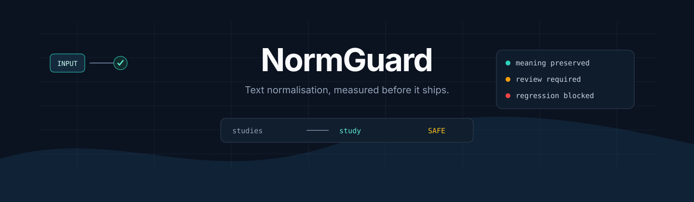
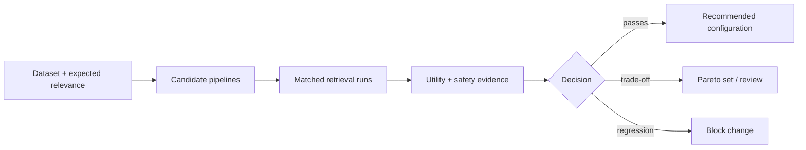

<div align="center">



[](research/charter.md)
[](research/landscape.md)
[](LICENSE)

**A proposed domain-aware quality gate for text normalisation in Search, NLP and RAG systems.**

[Research charter](research/charter.md) · [Landscape](research/landscape.md) · [Evaluation plan](research/evaluation-plan.md) · [Architecture](docs/architecture.md) · [Contributing](CONTRIBUTING.md)

</div>

> [!IMPORTANT]
> NormGuard is in research validation. It is not yet a released library, and this repository does not claim a novel algorithm or proven retrieval improvement.

## The decision NormGuard aims to improve

Stemming and lemmatisation are easy to enable. Their downstream consequences are harder to justify.

A transformation may improve lexical matching, do nothing for dense retrieval, or corrupt a term whose exact form matters. NormGuard investigates whether developers can evaluate those trade-offs before a pipeline reaches production.

| Input | Candidate output | Diagnostic |
|---|---|---|
| `studies` | `study` | plausible lemma |
| `went` | `go` | context-aware lemma |
| `REF-2048` | unchanged | protected reference |
| `university` | `univers` | aggressive stem requiring review |

## Proposed quality loop



The intended output is not always a winner. A defensible **inconclusive** result is better than an unsupported recommendation.

## What may become distinctive

Existing libraries already implement text-processing algorithms. NormGuard's proposed contribution is the quality layer around them:

- compare no-normalisation, stemming and lemmatisation baselines;
- evaluate lexical, dense, hybrid and RAG retrieval separately;
- detect changes to protected domain terminology;
- report harmful over-normalisation examples;
- recommend only when declared utility and safety thresholds pass;
- run the same checks as a CI regression gate;
- preserve machine-readable evidence behind every decision.

These are hypotheses to validate, not completed features.

## Phase 1 research map

```mermaid
flowchart TD
    A["Existing tools and papers"] --> D["Evidence matrix"]
    B["Developer workflows"] --> D
    C["Datasets and metrics"] --> D
    D --> E["Defensible gap?"]
    E -->|yes| F["Freeze proof-of-concept protocol"]
    E -->|narrow| G["Reposition scope"]
    E -->|no| H["Stop with documented findings"]
```



### Phase 1 outputs

- [ ] sourced competitor and literature matrix;
- [ ] three concrete developer workflows;
- [ ] dataset and licensing assessment;
- [ ] frozen benchmark and statistical plan;
- [ ] terminology-safety taxonomy;
- [ ] novelty and feasibility decision;
- [ ] go, narrow, reposition, or stop recommendation.

## Initial measurement model

| Dimension | Example measures | Why it matters |
|---|---|---|
| Retrieval utility | Recall@k, nDCG@k, MRR | determines whether useful evidence is found |
| Terminology safety | corruption rate, protected-term violations | prevents damage to exact domain meaning |
| Efficiency | p50/p95 latency, memory, index size | exposes operational cost |
| Transformation behaviour | vocabulary reduction, error taxonomy | explains why performance changed |
| Uncertainty | confidence intervals, per-domain variance | prevents false certainty |

LLM token savings are not assumed. They will be measured only where the tokenizer and downstream workflow make the comparison meaningful.

## Research architecture


The proposed experiment accepts documents, queries and relevance labels; validates them; runs matched candidate pipelines; measures retrieval utility and terminology safety; and returns a recommendation, Pareto set, or inconclusive result.

See the [architecture document](docs/architecture.md) for the complete diagram and trust boundary.

## Visual evidence standard

NormGuard uses a restrained diagnostic identity: ink and slate for structure, teal for verified-safe outcomes, amber for uncertainty, and red for regressions. Charts require labelled axes, units, sample size, uncertainty and traceable source data.

See the [visual system](docs/visual-system.md).

## Repository map

```text
docs/
  architecture.md       proposed system and trust boundary
  visual-system.md      visual and chart quality rules
  assets/               versioned visual assets
research/
  charter.md            questions, hypotheses and exit criteria
  landscape.md          existing solutions and closest overlap
  evaluation-plan.md    metrics, controls and planned figures
CONTRIBUTING.md         evidence and pull-request standards
```

## Collaboration

Work happens through focused issues, feature branches and reviewed pull requests. During Phase 1, evidence quality takes priority over implementation volume.

Read [CONTRIBUTING.md](CONTRIBUTING.md) before starting a research task.

## Licence

Apache-2.0. Third-party software, models and datasets retain their own licences.
