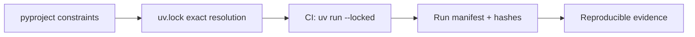

# ADR 0001: Proof-of-concept Python and evaluation stack

- **Status:** Proposed for team approval
- **Date:** 18 September 2026
- **Protocol:** NG-POC-001 v0.1.0
- **Decision owners:** NormGuard maintainers

## Context

The first NormGuard implementation must test one narrow question: whether protected POS-aware lemmatisation improves English retail BM25 retrieval over minimal normalisation without corrupting protected terms.

The stack must run on CPU, expose transformation traces, preserve reproducibility, avoid implementing standard IR metrics from scratch, and remain small enough for contributors to understand.

## Decision summary

| Concern | Selection | Initial pin / rule |
|---|---|---|
| Python | CPython | `>=3.12,<3.13` |
| Project/lock manager | uv | commit generated `uv.lock`; CI uses `uv run --locked` |
| C0 baseline | Python standard library | `unicodedata.normalize("NFC", text)`, explicit whitespace policy, `casefold()` |
| C4 POS/lemma engine | spaCy | `spacy==3.8.16` |
| English model | spaCy `en_core_web_sm` | 3.8-series wheel; exact URL and SHA-256 pinned in lock/bootstrap before code merge |
| BM25 | BM25S | `bm25s==0.3.11` |
| IR metrics | ir-measures | `ir-measures==0.4.3` |
| Numeric/bootstrap work | NumPy | exact version resolved and committed in `uv.lock` |
| Test runner | pytest | compatible version resolved and committed in `uv.lock` |
| Lint/format | Ruff | compatible version resolved and committed in `uv.lock` |
| Schema layer | Python typed models first | Pydantic decision deferred to issue #22 |

Direct production dependencies use narrow declared constraints. The committed lockfile is the executable version record for transitive dependencies. A run manifest additionally records installed package/model versions and hashes.

## Why Python 3.12

- Supported by the selected spaCy release and current scientific stack.
- Mature wheel availability across common Linux, macOS and Windows environments.
- Avoids unnecessarily requiring the newest interpreter for the POC.
- Provides one interpreter target, reducing cross-version variation.

Python patch version, operating system, CPU and installed distributions must be captured in each run manifest.

## C0: minimal baseline

C0 uses only the standard library:

1. Unicode NFC normalisation;
2. a declared whitespace rule;
3. Unicode-aware `casefold()`;
4. no stemming or lemmatisation.

C0 must emit an offset-aware trace. Case and Unicode changes are not assumed harmless: the trace remains available to the audit layer.

### Rejected C0 alternatives

| Alternative | Reason rejected for POC |
|---|---|
| NFKC by default | Can make compatibility transformations that require a separate policy decision |
| Hugging Face Tokenizers normalizer | Useful later, but adds a dependency when standard-library behaviour is enough for C0 |
| Lowercase only | Less explicit for Unicode text than `casefold()` |
| No transformation baseline | Retained conceptually, but C0 needs stable case/Unicode behaviour for the primary experiment |

## C4: protected POS-aware lemmatisation

C4 composes:

1. the C0 character policy;
2. protected-span detection before morphological transformation;
3. spaCy English tokenisation, POS tagging and rule-based lemmatisation;
4. P0 exact preservation, P1 approved aliases, P2 contextual normalisation, and P3 preserve-and-review;
5. input/output token and offset traces.

Only components needed for tagging and lemmatisation should remain enabled. Named-entity recognition is not a substitute for the protected-term policy.

### Why spaCy

- Maintained, production-oriented library with an MIT licence.
- POS-aware lemmatisation and packaged English pipelines.
- Token objects expose text, lemma, POS and character offsets.
- CPU execution is sufficient for the initial experiment.
- Already established in the Phase 1 landscape; NormGuard is evaluating it, not claiming it as an invention.

### Rejected C4 alternatives

| Alternative | Reason not selected as primary C4 |
|---|---|
| Stanza | Credible POS-aware alternative, but a second NLP runtime adds weight before the core hypothesis is tested |
| NLTK WordNet | Lighter but POS preparation and token/offset integration require more custom composition |
| Lookup-only lemma | Kept as protocol C2, not the contextual C4 candidate |
| Transformer pipeline | Higher installation/runtime cost without a Phase 1 requirement |
| LLM normalisation | Nondeterministic, expensive and inappropriate for exact identifier gates |

## BM25 retrieval

`bm25s==0.3.11` is selected for the POC.

Reasons:

- small, CPU-friendly Python package;
- MIT licence;
- explicit corpus token input makes C0/C4 comparisons inspectable;
- avoids operating an external search cluster for the first falsification experiment;
- supports the frozen BM25 parameter grid.

Risk: BM25S has a small maintainer base. NormGuard must validate scoring and ranking on a committed hand-calculated fixture and preserve an adapter boundary so the backend can be replaced.

### Rejected retrieval alternatives

| Alternative | Reason not selected now |
|---|---|
| Elasticsearch/OpenSearch | Strong future adapter, but cluster setup obscures the first pipeline experiment |
| PyTerrier | Powerful research platform but broader/heavier than the initial need |
| Pyserini/Anserini | Strong reference ecosystem with Java/runtime weight unnecessary for the first POC |
| Hand-written BM25 | Avoid reimplementing standard ranking logic and its edge cases |

## Metrics and statistical analysis

`ir-measures==0.4.3` computes nDCG@10, MRR@10, Precision@10, Recall@10 and Recall@100 from qrels and runs.

NumPy will implement the protocol's deterministic 10,000 paired bootstrap samples and sign-flip/randomisation sensitivity analysis. The implementation must:

- accept an explicit seed;
- operate on aligned per-query metric arrays;
- record the NumPy version and bit generator;
- test fixed toy cases;
- expose sampled indices or sufficient parameters for reproduction.

Do not call a corrected p-value a product win unless H2, H3 and H4 also pass.

## Environment and lock strategy

The project will use `pyproject.toml` plus a committed `uv.lock`.

Rules:

- CI fails when the lockfile is stale;
- upgrades occur only in explicit dependency PRs;
- the spaCy model wheel URL and SHA-256 are treated as dependencies, not an untracked download step;
- dependency metadata and licences are included in the evidence bundle;
- final-test runs use the same lockfile as approved development runs;
- no global environment is part of the protocol.

## Offset and protection boundary

Protected spans are identified against the original input before spaCy lemma replacement. The common trace must retain:

- original text and original character offsets;
- C0-normalised surface;
- tokenizer offsets;
- POS and candidate lemma;
- policy class and matched rule ID;
- emitted text;
- whether the transformation was applied, preserved or sent to review;
- engine-native metadata.

If offsets cannot be mapped deterministically after a transformation, the case is F07 and cannot silently pass.

## Consequences

### Positive

- Lightweight local POC without search-cluster operations.
- Existing, tested implementations for NLP, ranking and metrics.
- Clear adapter seams for later Elasticsearch/OpenSearch and Stanza comparisons.
- Exact dependency state can be committed and recorded.

### Negative

- spaCy model installation is the largest dependency.
- BM25S is less established than Lucene-based engines.
- C4 results initially describe one English model, not lemmatisation generally.
- A Python-only first adapter does not itself prove cross-engine value.

## Validation required before implementation approval

- [ ] Confirm the exact `en_core_web_sm` 3.8-series wheel URL and SHA-256.
- [ ] Generate and commit `uv.lock` on the selected Python range.
- [ ] Verify clean installs on Linux and macOS.
- [ ] Add one BM25 hand-check fixture.
- [ ] Add one offset-preservation fixture.
- [ ] Record dependency licences.
- [ ] Obtain a second maintainer review.

## Sources checked

- [spaCy PyPI release and compatibility metadata](https://pypi.org/project/spacy/)
- [spaCy model releases](https://github.com/explosion/spacy-models/releases)
- [BM25S PyPI release](https://pypi.org/project/bm25s/)
- [ir-measures PyPI release](https://pypi.org/project/ir-measures/)
- [uv project lockfile documentation](https://docs.astral.sh/uv/concepts/projects/layout/)
- [uv locking and syncing documentation](https://docs.astral.sh/uv/concepts/projects/sync/)

## Review trigger

Revisit this ADR if clean installation fails, offsets cannot be traced reliably, BM25 validation differs from the reference fixture, or C4 cannot satisfy deterministic CPU execution.
