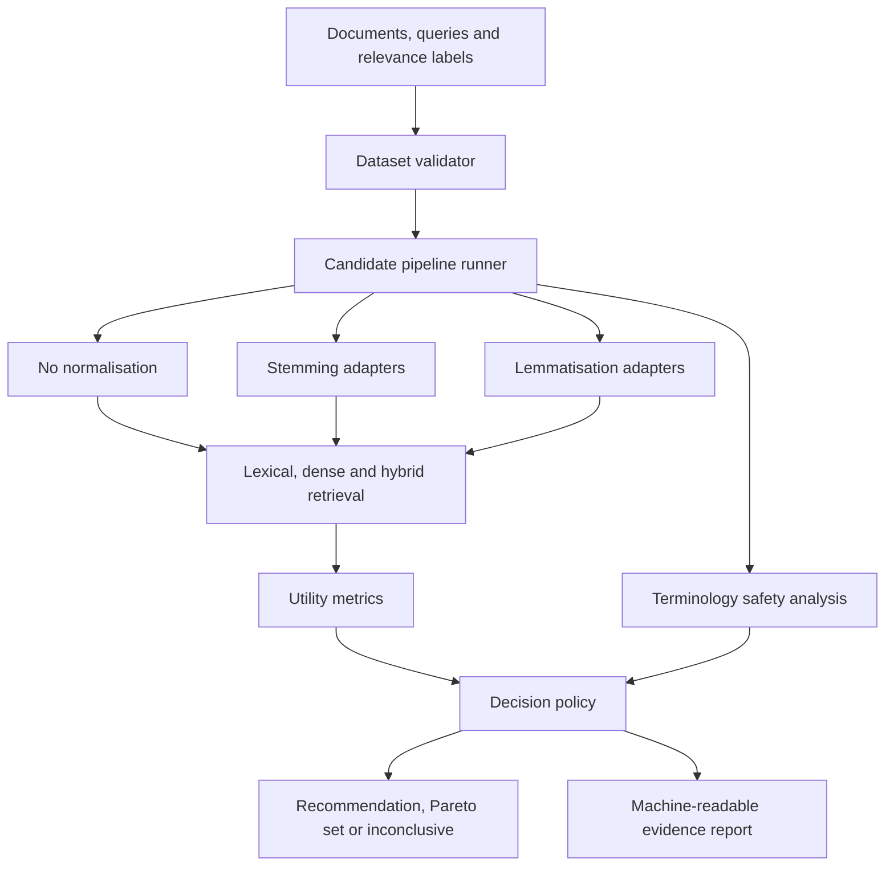

# Proposed Research Architecture

This is a research hypothesis, not an implemented system.

## Trust boundary

NormGuard should recommend configurations only from declared datasets, metrics and thresholds. It must preserve the baseline, retain failed candidates, expose protected-term changes, and avoid silently rewriting production configuration.

## Proposed components

| Component | Responsibility |
|---|---|
| Dataset validator | Validate documents, queries, relevance labels and splits |
| Pipeline adapters | Provide a common interface to existing normalisation engines |
| Term protector | Preserve exact identifiers and approved domain terminology |
| Retrieval harness | Run matched lexical, dense and hybrid experiments |
| Metric engine | Calculate utility, safety, latency and resource measures |
| Decision policy | Apply explicit thresholds and uncertainty rules |
| Evidence reporter | Produce JSON, Markdown and visual summaries |
| CI gate | Compare candidate evidence with an approved baseline |

No component is approved for implementation until the Phase 1 landscape and evaluation design are reviewed.
