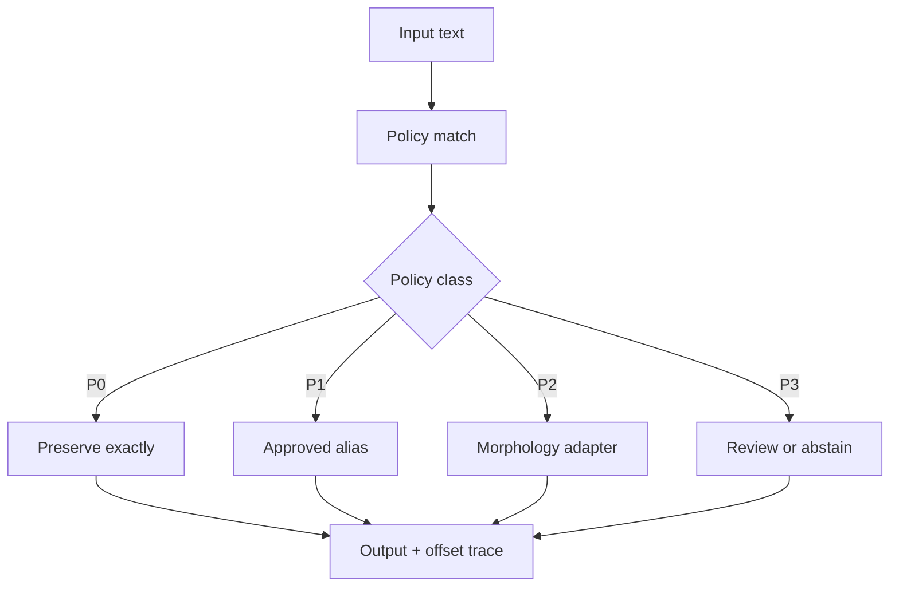

# Protected normalisation pipeline

This is the first executable NormGuard safety boundary. It is engine-neutral: a
lemmatiser is injected behind the policy layer, so protected terminology is resolved
before any morphology engine sees the text.

## Deterministic precedence

Matches are ordered by source offset, then longest match, then rule identifier.
Already occupied source spans are skipped. This gives reproducible overlap handling
without allowing a later rule to modify a protected span.

## Current boundary

This unit proves policy ordering, transformation traces and safe engine injection
using synthetic retail examples. It does not claim retrieval improvement and does
not read ESCI or the sealed final-test split.
