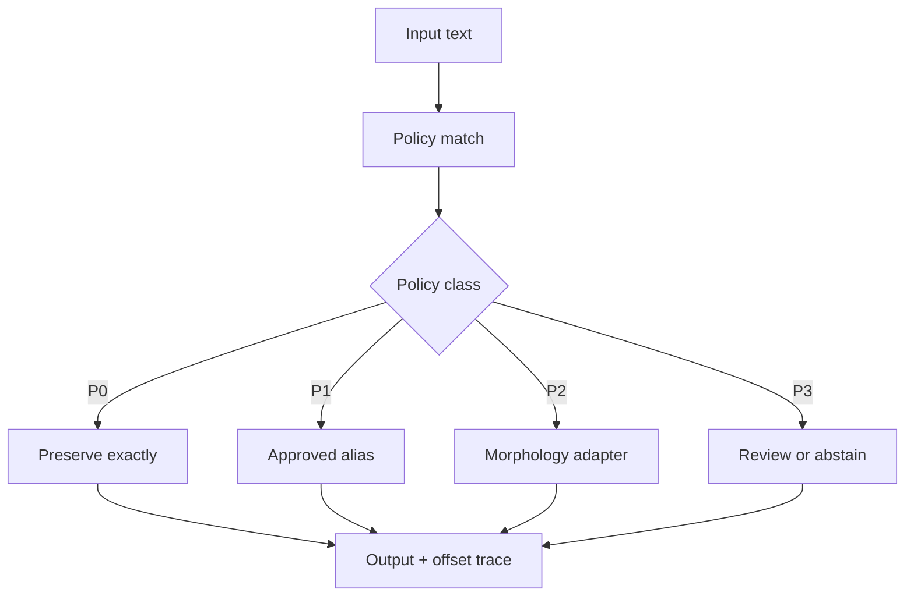

# Protected normalisation pipeline

This is the first executable NormGuard safety boundary. It is engine-neutral: a
lemmatiser is injected behind the policy layer, so protected terminology is resolved
before any morphology engine sees the text.

## Deterministic precedence

Overlaps are resolved by safety class first (P0, P1, P3, P2), then longest span,
source offset and rule identifier. A candidate is accepted only when it does not
overlap an already selected higher-priority span. Selected spans are returned in
source order. This makes protection deterministic and prevents a broad morphology
rule from taking precedence over an exact-preservation rule.

## Current boundary

This unit proves policy ordering, transformation traces and safe engine injection
using synthetic retail examples in
`examples/retail-normalisation-cases.json`. It does not claim retrieval improvement
and does not read ESCI or the sealed final-test split.
