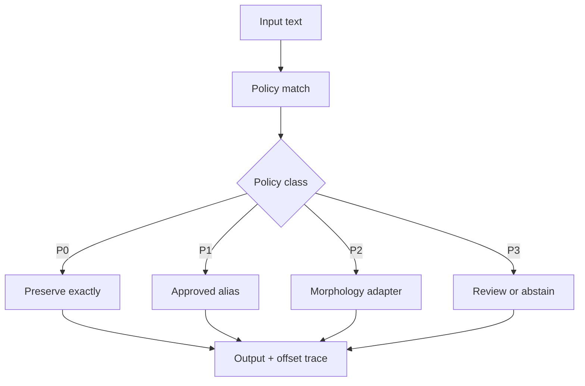

# Protected normalisation pipeline

This is the first executable NormGuard safety boundary. It is engine-neutral: a
lemmatiser is injected behind the policy layer, so protected terminology is resolved
before any morphology engine sees the text.

```mermaid
flowchart TD
    A["Input text"] --> B["Policy match"]
    B --> C{"Policy class"}
    C -->|P0| D["Preserve exactly"]
    C -->|P1| E["Approved alias"]
    C -->|P2| F["Morphology adapter"]
    C -->|P3| G["Review or abstain"]
    D --> H["Output + offset trace"]
    E --> H
    F --> H
    G --> H
```

## Deterministic precedence

Overlaps are resolved by safety class first (P0, P1, P3, P2), then longest span,
source offset and rule identifier. A candidate is accepted only when it does not
overlap an already selected higher-priority span. Selected spans are returned in
source order. This makes protection deterministic and prevents a broad morphology
rule from taking precedence over an exact-preservation rule.

## Current boundary

`C0Adapter` implements the NFC, whitespace and Unicode-casefold baseline without
lemmatisation. `C4SpacyAdapter` applies the same character policy and uses the pinned
spaCy English model for contextual POS-aware lemmatisation. The C4 adapter loads only
the components needed for tagging and lemmatisation; parser and NER are disabled.

Before C4 invokes spaCy, P0, P1 and P3 spans are replaced in an equal-length masked
view. spaCy therefore receives sentence context and stable character offsets without
receiving the protected source text as a morphology candidate. P2 and unprotected
tokens retain tokenizer offsets, POS, candidate lemmas and engine versions in their
traces. Protected spans are emitted only according to their policy rule.

These units prove policy ordering, transformation traces and safe engine boundaries
using synthetic retail examples in `examples/retail-normalisation-cases.json`. They do
not claim retrieval improvement and do not read ESCI or the sealed final-test split.
