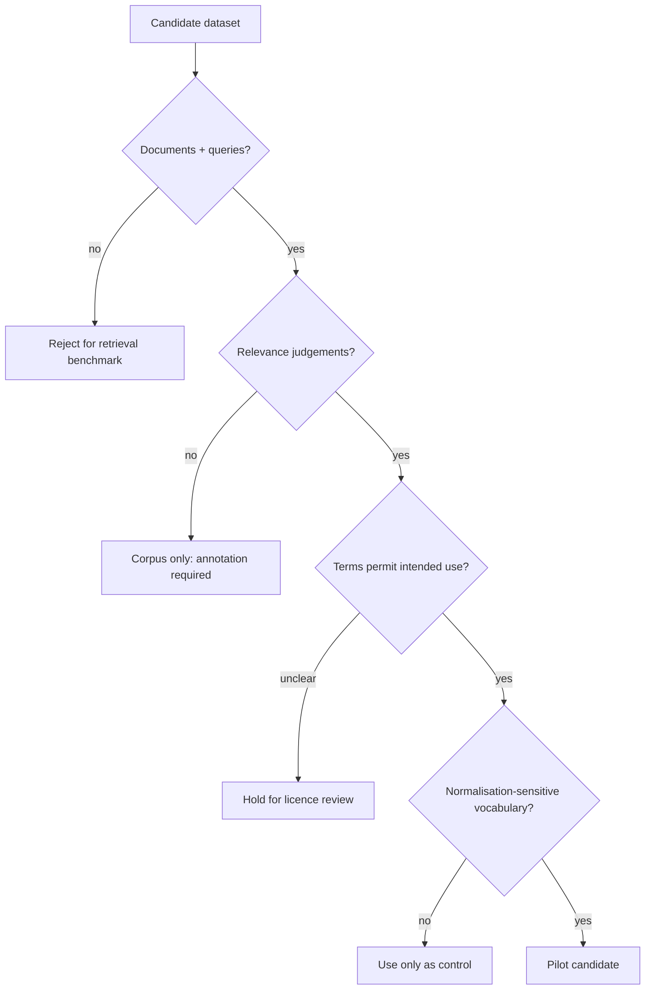

# Dataset and Licensing Assessment

Status: **Phase 1 candidate assessment — 18 September 2026**

## Decision summary

The three proposed domains are not equally ready for a reproducible proof of concept.

| Domain | Best current candidate | Relevance labels | Usage position | Readiness |
|---|---|---:|---|---|
| Retail | Amazon Shopping Queries (ESCI) | Yes, manual E/S/C/I labels | Repository states Apache-2.0 | High |
| Medical | NFCorpus | Yes, graded automatically extracted links | Free for academic purposes; other uses require separate consultation | Medium for research, low for unrestricted product demos |
| Cybersecurity | MITRE ATT&CK STIX | No retrieval qrels | Public release subject to ATT&CK terms | Corpus-ready, benchmark-not-ready |

### Recommendation

1. Use the English subset of Amazon ESCI as the primary proof-of-concept benchmark.
2. Use NFCorpus only for clearly academic/research evaluation after preserving its terms and attribution.
3. Treat cybersecurity as an exploratory terminology-safety study until independently reviewed queries and relevance judgements exist.
4. Do not claim a balanced three-domain benchmark in the first implementation.

This recommendation may change when additional datasets are verified.

## Selection criteria

A dataset is suitable only if it provides or permits:

- documents or items that can be indexed;
- realistic queries;
- relevance judgements;
- an explicit train/development/test strategy;
- terms compatible with repository and demonstration use;
- sufficient morphology and protected terminology to test normalisation;
- manageable compute and download requirements;
- traceable provenance.

---

## Retail — Amazon Shopping Queries Dataset

### Evidence

The [Amazon Science ESCI repository](https://github.com/amazon-science/esci-data) describes a large, manually annotated shopping-query dataset. Query–product pairs are labelled:

- **E** — Exact;
- **S** — Substitute;
- **C** — Complement;
- **I** — Irrelevant.

The repository reports:

- English, Spanish and Japanese queries;
- a reduced ranking version with 48,300 unique queries and more than 1.1 million judgements;
- a larger version with more than 130,000 queries and 2.6 million judgements;
- query-level train/test splits;
- product title, description, bullet point, brand and colour fields;
- Apache-2.0 licensing for the project.

### Suitability

**Strengths**

- Directly supports ranking evaluation.
- Labels are commercially realistic rather than generated for NormGuard.
- Contains brands, model identifiers, attributes and morphological variants.
- Large enough to create a fixed development subset and untouched test subset.
- Multilingual expansion is possible later without changing dataset family.

**Risks and limitations**

- The full dataset is larger than needed for an initial local benchmark.
- ESCI labels express shopping relevance, not specifically normalisation safety.
- Product descriptions and brand strings require an explicit handling policy.
- Repository licensing should be rechecked at the exact downloaded artifact level before redistribution.
- Public benchmark tuning can overfit known characteristics.

### Proposed first use

Use only the English reduced ranking data initially:

- preserve the official query split;
- sample a deterministic development subset for pipeline iteration;
- keep an untouched test subset;
- map E/S/C/I labels to declared graded relevance values;
- add a separate protected-term audit for brand, model and product identifiers;
- do not commit the full dataset to NormGuard.

### Verdict

**Primary pilot candidate.**

---

## Medical — NFCorpus

### Evidence

The [official NFCorpus page](https://www.cl.uni-heidelberg.de/statnlpgroup/nfcorpus/) describes:

- 3,244 natural-language queries;
- 9,964 technical medical documents, mostly from PubMed;
- 169,756 automatically extracted relevance judgements;
- 80/10/10 train, development and test splits at query level;
- graded relevance based on direct links, indirect links and topic/tag relationships.

Its terms state that NFCorpus is free for academic purposes. Other use of the included NutritionFacts.org data requires consulting the relevant terms and contacting the author.

### Suitability

**Strengths**

- Clear query, document and qrel structure.
- Lay-language queries against technical documents create a useful retrieval challenge.
- Small enough for reproducible CPU-scale lexical experiments.
- Terminology-rich documents can expose harmful transformations.

**Risks and limitations**

- Relevance judgements are derived from link structure rather than fresh expert annotation.
- The dataset concerns nutrition/medical information, not clinical decision support.
- Academic-use wording limits how it can be packaged or demonstrated.
- It cannot justify clinical safety or effectiveness claims.
- Its age may limit coverage of newer terminology.

### Proposed first use

- Use only in an explicitly labelled academic research experiment.
- Do not redistribute the corpus through NormGuard.
- Download it from its official source during reproduction.
- Report results as information retrieval research, not medical guidance.
- Add no clinical claims and do not treat transformation safety as clinically validated.

### Verdict

**Research-only secondary candidate, pending a repository-use review.**

---

## Cybersecurity — MITRE ATT&CK STIX

### Evidence

The [MITRE ATT&CK STIX repository](https://github.com/mitre-attack/attack-stix-data) provides versioned Enterprise, Mobile and ICS ATT&CK collections as STIX 2.1 JSON. It is a structured, public-release knowledge base with machine-readable objects and documented usage. The repository points users to the ATT&CK Terms of Use.

### Suitability

**Strengths**

- Strong technical vocabulary and stable identifiers.
- Versioned structured data supports reproducibility.
- Enterprise, Mobile and ICS domains are separable.
- Useful for a terminology-protection and transformation audit.

**Risks and limitations**

- It is not an information-retrieval benchmark.
- It does not provide natural user queries with relevance judgements.
- Generating queries and answers from the same content risks circular evaluation.
- Synthetic qrels would not demonstrate real developer value.
- ATT&CK naming and attribution requirements must be preserved.

### Proposed first use

Use ATT&CK only for a terminology-safety suite:

- identifiers and named techniques that must remain unchanged;
- inflected natural-language descriptions for transformation inspection;
- version-pinned source data;
- no retrieval-quality claim until independent query/qrel annotation exists.

A future cybersecurity benchmark requires:

1. independently authored information needs;
2. candidate documents fixed before judgement;
3. at least two knowledgeable reviewers for a validation sample;
4. disagreement tracking and adjudication;
5. a held-out test set that is not used to develop protected-term rules.

### Verdict

**Useful corpus; not yet a valid retrieval benchmark.**

---

## Additional candidates to investigate

| Domain | Candidate | Why investigate | Main question |
|---|---|---|---|
| Medical | TREC-COVID / BEIR | Established IR qrels and common tooling | Are redistribution and current-use conditions suitable? |
| Medical | BioASQ | Expert biomedical questions and relevance | Which task version and licence are usable? |
| Retail | WANDS | Product-search relevance judgements | Licence and coverage compared with ESCI |
| Cybersecurity | CyberMetric | Security questions and referenced material | Is it a retrieval benchmark or primarily LLM QA evaluation? |
| Cybersecurity | CTI report datasets | Rich terminology and real reports | Are query/qrel pairs independently annotated? |
| General control | BEIR datasets | Standard retrieval baselines | Which subset best tests normalisation sensitivity? |

## Data-governance rules

- Never commit full third-party corpora unless redistribution is explicitly permitted and necessary.
- Store acquisition scripts, checksums, version identifiers and source URLs.
- Pin dataset releases or immutable snapshots.
- Record every transformation from source data to benchmark data.
- Keep development and final evaluation sets separate.
- Do not use sensitive, private or proprietary documents.
- Do not infer permission from public availability.
- Preserve required citations, notices and trademarks.
- Document removed records and failed downloads.

## Phase 1 decision gate

The proof-of-concept may begin when:

- one primary dataset has clear use terms and judged retrieval pairs;
- a deterministic subset and split policy is approved;
- protected-term categories are defined without inspecting final outcomes;
- success, regression and inconclusive thresholds are frozen;
- a second dataset is approved for external validity.

If only Amazon ESCI passes these conditions, NormGuard should start as a **retail-search normalisation evaluation pilot** and add other domains later. Cross-industry ambition should not override evidence quality.
