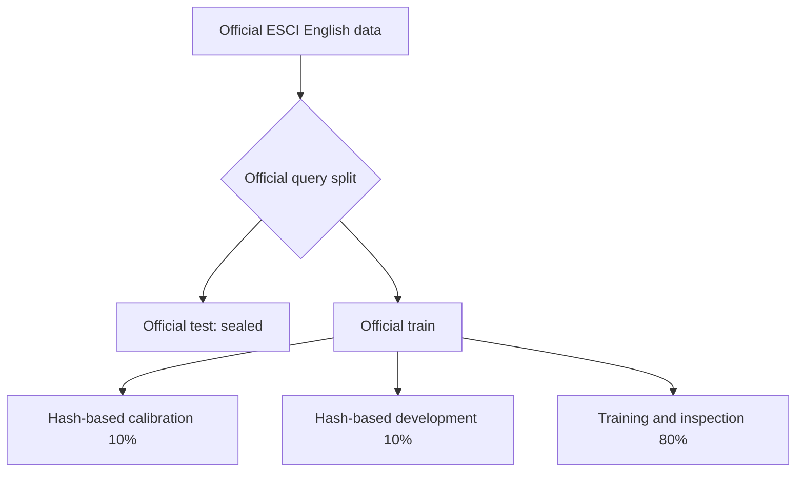
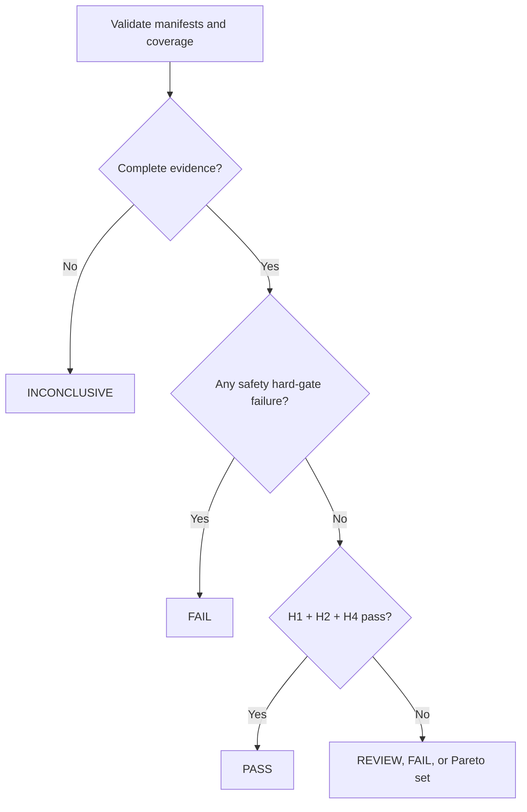

# Proof-of-concept evaluation protocol

> **Protocol ID:** NG-POC-001  
> **Version:** 0.1.0 — proposed freeze  
> **Date:** 18 September 2026  
> **Status:** awaiting team approval; no benchmark results inspected

## Purpose

This protocol tests whether a domain-aware text-normalisation policy improves product-search retrieval without corrupting protected terminology. It is written before implementation and before inspecting final-test outcomes.

The first proof of concept is deliberately narrow: **English retail search using the Amazon Shopping Queries ESCI dataset and lexical retrieval**. Medical and cybersecurity material remain external-validity and terminology-safety studies until their usage and judgement constraints support equivalent experiments.

## Pre-registered questions

### Primary question

Does a protected, context-aware normalisation pipeline improve query-level **nDCG@10** over a minimal-normalisation baseline on held-out English ESCI queries while satisfying every mandatory terminology-safety gate?

### Secondary questions

- What happens to MRR@10, Recall@10, Recall@100, and Precision@10?
- Which pipeline lies on the best safety–utility–latency trade-off?
- Are gains concentrated in morphologically sensitive queries?
- How frequently do pipelines over-normalise, under-normalise, mislemmatise, or alter identifiers?
- How much vocabulary reduction and latency overhead does each pipeline introduce?

No token-cost or RAG-generation claim is part of the primary POC.

## Hypotheses and outcomes

| ID | Type | Pre-registered statement |
|---|---|---|
| H1 | Primary | Protected context-aware lemmatisation has a positive paired nDCG@10 difference versus the minimal baseline, with a 95% bootstrap confidence interval whose lower bound is above zero. |
| H2 | Practical effect | The mean nDCG@10 improvement is at least **0.005 absolute**. |
| H3 | Safety | The candidate produces zero unauthorised P0 changes, 100% exact identifier retention, and zero S0 events. |
| H4 | Operational | Candidate p95 normalisation latency is no more than **2×** the minimal baseline and adds no more than **10 ms per query** in the fixed test environment. |

H1 is the statistical primary outcome. H2 prevents a tiny but statistically detectable change from being presented as a useful win. H3 is a hard gate. H4 is a provisional engineering threshold and must be reported even if hardware makes it easy to satisfy.

## Dataset and split policy

### Primary benchmark

Use the **English reduced-ranking configuration** of the [Amazon Shopping Queries ESCI dataset](https://github.com/amazon-science/esci-data), subject to a final artefact-level licence check.

| ESCI label | Gain |
|---|---:|
| Exact | 3 |
| Substitute | 2 |
| Complement | 1 |
| Irrelevant | 0 |

### Immutable split construction

1. Preserve the official query-level train/test boundary.
2. Treat the official test queries as the untouched **final test**.
3. Create development and calibration partitions only from official training queries.
4. Sort unique query IDs by a SHA-256 hash of `protocol_id + ":" + query_id`.
5. Assign the first 10% to **calibration**, the next 10% to **development**, and the remaining 80% to **training/inspection**.
6. Record the dataset release, source checksum, row/query counts, and split-manifest checksum.
7. Never move queries between partitions after any result is observed.

Calibration is for protected-term rules and taxonomy trials. Development is for implementation choices. Final test runs only after configurations and thresholds are locked.



The full third-party dataset must not be committed. Acquisition code, source URL, checksums, and permitted derived manifests may be committed.

## Experimental configurations

All configurations receive identical text fields and retrieval settings. Each must be deterministic and version-pinned.

| ID | Configuration | Role |
|---|---|---|
| C0 | Unicode normalisation + whitespace handling + case policy | minimal baseline |
| C1 | C0 + Snowball stemming | algorithmic comparison |
| C2 | C0 + lookup lemmatisation | context-light comparison |
| C3 | C0 + POS-aware lemmatisation | contextual comparison |
| C4 | C3 + P0/P1/P3 terminology policy | primary NormGuard candidate |
| C5 | C1 + P0/P1/P3 terminology policy | protected-stemming ablation |

Do not combine stemming and lemmatisation in the primary matrix. Any additional configuration requires a protocol amendment before final testing.

For every configuration, record library/model/dictionary/ruleset versions, locale, Unicode form, tokenizer and POS settings, protected policy version, index/query chains, seeds, and a configuration hash.

## Retrieval protocol

### Confirmatory mode: lexical

Use one version-pinned BM25 implementation. Tune only on development data using:

- k1 in {0.6, 0.9, 1.2, 1.5}
- b in {0.25, 0.50, 0.75}

Select one pair using C0 development nDCG@10; break ties by smaller k1, then smaller b. Freeze it for all configurations and final test. Freeze product fields and boosts before final testing. Never retune retrieval per normaliser.

### Exploratory modes

Dense, hybrid, and RAG retrieval may be run later but must be labelled **exploratory** under version 0.1.0. They cannot determine the primary verdict.

## Terminology-safety sample

- derive P0/P1 candidates from product identifiers, brands, model-like strings, units, and version-like strings;
- define extraction rules on calibration data only;
- include all detected protected spans in the evaluated split;
- stratify manual review across changed/unchanged outputs, policy classes, and configurations;
- double-review all S0/S1 candidates and at least 20% of other manual samples;
- preserve disagreement and adjudication records.

Use the policy classes, failures, and annotation fields in [terminology-safety.md](terminology-safety.md).

## Metrics

### Confirmatory

- query-level nDCG@10;
- protected-term violation rate;
- exact identifier retention;
- S0 event count;
- query normalisation p95 latency.

### Secondary

- MRR@10, Precision@10, Recall@10, and Recall@100;
- harmful transformation and query/index asymmetry rates;
- abstention/review rate;
- F01–F10 and S0–S3 counts;
- vocabulary and index-size change;
- p50 latency, throughput, and peak memory.

Report undefined denominators as **not applicable**, never as zero.

## Statistical analysis

1. Compute retrieval metrics per query before aggregation.
2. Compare candidates with C0 using paired query results.
3. Estimate 95% confidence intervals with **10,000 paired bootstrap resamples** and a fixed recorded seed.
4. Use a two-sided paired randomisation test as sensitivity analysis for C4 versus C0 nDCG@10.
5. Report absolute/relative differences, confidence intervals, and exact query counts.
6. Apply Holm correction across C1–C5 comparisons with C0 for the primary metric.
7. Show score distributions and per-query deltas, not only means.
8. Treat subgroup findings as exploratory unless added through a pre-test amendment.

A corrected p < 0.05 alone is insufficient: H2 and every safety gate must also pass.

## Decision rules



| Outcome | Required condition |
|---|---|
| **PASS** | H1, H2, H3, and H4 pass; no unresolved integrity issue |
| **REVIEW** | H3 passes but utility/operational evidence is mixed or a material trade-off remains |
| **FAIL** | H3 fails, a confirmed regression breaches policy, or the run violates protocol |
| **INCONCLUSIVE** | evidence is incomplete, corrupted, underpowered, or not reproducible |

If multiple candidates pass and none dominates quality, safety, and latency, publish a **Pareto set** instead of one winner.

## Stop and invalidation criteria

Stop the affected run and preserve artefacts when:

- an unauthorised P0 change or suspected S0 event appears;
- split leakage is detected;
- dataset, index, qrel, or configuration checksums differ unexpectedly;
- query/index analysis is unintentionally asymmetric;
- more than 1% of queries fail processing;
- labels or IDs cannot be joined deterministically;
- C0 cannot be reproduced within declared tolerance;
- a licence or usage restriction is unresolved.

An implementation crash is a run failure, not poor relevance.

## Reproducibility manifest

Every run must emit one machine-readable manifest containing:

```yaml
protocol_id: NG-POC-001
protocol_version: 0.1.0
dataset:
  name: amazon-esci
  release: pending-pin
  source_sha256: pending
  split_manifest_sha256: pending
configuration:
  id: C4
  config_sha256: pending
retriever:
  implementation: pending-pin
  k1: pending-development-selection
  b: pending-development-selection
environment:
  os: pending
  cpu: pending
  memory_gb: pending
execution:
  seed: pending-freeze
  started_at_utc: pending
outputs:
  metrics_sha256: pending
  annotations_sha256: pending
```

All pending values must be resolved before final test. Retain the completed manifest, summary metrics, releasable annotations, and chart inputs together.

## Required figures

| Figure | Encoding | Required content |
|---|---|---|
| Retrieval comparison | point + 95% CI | nDCG@10 delta versus C0 for C1–C5 |
| Safety–utility frontier | scatter | nDCG@10 delta vs harmful transformation rate; latency encoded separately |
| Protected-term heatmap | heatmap | violations by policy class and failure code |
| Per-query effects | distribution | paired nDCG@10 deltas with zero reference |
| Latency profile | box/violin + p95 | query latency by configuration |
| Vocabulary trade-off | scatter | vocabulary-size change vs nDCG@10 delta |
| Error composition | stacked bars | F01–F10 by configuration and severity |

Generate figures only from machine-readable summaries. Colours must work without red/green interpretation; every chart needs sample size and units. Mock-ups must explicitly say **no measured results**.

## Change control

Before final-test execution, changes require a reasoned PR, protocol version increment, amendment entry, and confirmation that no final result informed the change. After final results are viewed, changes create a new confirmatory protocol; post-hoc analysis is exploratory.

### Amendment log

| Version | Date | Change | Final-test results viewed? |
|---|---|---|---|
| 0.1.0 | 18 September 2026 | Initial proposed freeze | No |

## Approval checklist

- [ ] dataset artefact and use terms rechecked;
- [ ] exact release and checksums pinned;
- [ ] C0–C5 implementations and versions selected;
- [ ] protected-term extraction rules reviewed;
- [ ] BM25 fields declared;
- [ ] fixed seed recorded;
- [ ] environment recorded;
- [ ] no final-test result inspected;
- [ ] two team members approve the freeze.

Until every item is checked, this is a **proposed protocol**, not an executed or validated benchmark.
