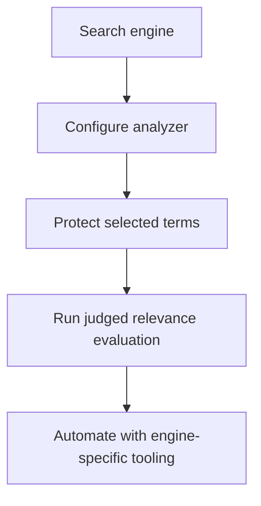

# Landscape Review

Status: **first primary-source verification pass — 18 September 2026**

## Scope and interpretation

This document separates three categories that are often grouped together:

1. **morphological processors** — stemmers and lemmatisers;
2. **character/token normalisers** — Unicode, case, accent and replacement processing;
3. **search analysis systems** — index/query analyzers that use normalisation components.

A capability marked “not documented” means it was not found in the cited product documentation reviewed during this pass. It does not prove that no extension or external workflow can provide it.

## Verified capability matrix

| Solution | Category | Relevant capability | Customisation / protection | Task-level retrieval evaluation | Automatic pipeline recommendation |
|---|---|---|---|---|---|
| NLTK | Morphological library | Porter, Snowball, Lancaster, language-specific stemmers and WordNet lemmatisation | Algorithm- and component-dependent | Not documented | Not documented |
| spaCy | NLP pipeline | Lookup, rule/POS-based and trainable lemmatisation | Configurable pipeline, lookup tables and language factories | Not documented | Not documented |
| Stanza | NLP pipeline | POS-aware `LemmaProcessor`; seq2seq, dictionary and edit-classifier options | Custom key-value lemma dictionary and training options | Not documented | Not documented |
| Snowball | Stemming algorithms | Language-specific stemming algorithms and generated implementations | Algorithm definitions are extensible through Snowball | Not documented | Not documented |
| Hugging Face Tokenizers | Character/token normalisation | Unicode forms, lowercase, accent stripping, regex replacement and ordered sequences | Composable normalizer sequences | Not documented | Not documented |
| Elasticsearch | Search analysis | Algorithmic/dictionary stemming at index and search time | Override rules, keyword markers, conditionals and stem exclusions | Analyzer testing exists; dedicated cross-pipeline recommendation is not documented | Not documented |
| OpenSearch | Search analysis | Language-configurable stemmer token filter | Analyzer/filter configuration | Dedicated recommendation is not documented | Not documented |
| Apache Solr | Search analysis | Language-specific analyzers, stemmers, protected terms and overrides | Filter-chain configuration and protected word files | Dedicated cross-pipeline recommendation is not documented | Not documented |
| Proposed NormGuard scope | Quality layer | Adapters over candidate pipelines | Domain-term protection and declared safety policy | Matched lexical, dense, hybrid and RAG evaluation | Evidence-based recommendation, Pareto set or inconclusive result |

## Evidence register

| Source | Verified observation | Limitation | Accessed |
|---|---|---|---|
| [NLTK stem package](https://www.nltk.org/api/nltk.stem.html) | Documents a common stemmer interface, Porter variants, Snowball language stemmers, other language-specific stemmers and WordNet lemmatisation. It explicitly notes irregular words, morphology, POS and sense ambiguity as difficulties. | API documentation does not describe retrieval experiments or automatic method selection. | 2026-09-18 |
| [spaCy Lemmatizer API](https://spacy.io/api/lemmatizer) | Lemmas may be assigned through lookup or POS-dependent rules; spaCy also links a trainable EditTreeLemmatizer. The component is configurable and language-specific. | Rule and POS-lookup modes depend on earlier POS assignment; the page evaluates the component, not downstream retrieval choices. | 2026-09-18 |
| [Stanza lemmatisation](https://stanfordnlp.github.io/stanza/lemma.html) | Uses token text and universal POS; supports statistical, dictionary-only, ensemble and edit-classifier behaviours, plus pretagged input and custom dictionary entries. | It is a lemmatisation processor rather than a cross-engine retrieval quality gate. | 2026-09-18 |
| [Snowball algorithms](https://snowballstem.org/algorithms/) | Publishes stemming algorithms for multiple languages. | Algorithm availability does not answer which method is best for an application. | 2026-09-18 |
| [Hugging Face Tokenizers normalizers](https://huggingface.co/docs/tokenizers/api/normalizers) | Provides Unicode NFC/NFD/NFKC/NFKD, lowercasing, accent stripping, replacement and composable sequences while supporting offset alignment. | This normalizer API is not a lemmatisation evaluator or retrieval recommender. | 2026-09-18 |
| [Elasticsearch stemming guide](https://www.elastic.co/docs/manage-data/data-store/text-analysis/stemming) | Distinguishes algorithmic and dictionary stemming; recommends consistent index/search analysis; documents speed/memory trade-offs and controls for harmful conflation. | Configuration guidance is substantial, but this page does not compare candidate pipelines against developer-supplied relevance judgements. | 2026-09-18 |
| [OpenSearch stemmer filter](https://docs.opensearch.org/latest/analyzers/token-filters/stemmer/) | Provides a configurable language stemmer as part of an analyzer chain. | Documentation describes configuration rather than automatic task-aware selection. | 2026-09-18 |
| [Apache Solr language analysis](https://solr.apache.org/guide/solr/latest/indexing-guide/language-analysis.html) | Provides language-specific analysis chains and stemming-related filters, including protected-term mechanisms for relevant analyzers. | The guide does not establish a cross-engine normalisation regression gate. | 2026-09-18 |

## Important overlap with the proposed product

Elasticsearch already addresses part of the proposed safety story. It supports stemmer overrides, keyword markers, conditionals and stem exclusions. Consequently, **protected terms alone are not a differentiator**.

spaCy and Stanza already offer configurable and context-sensitive lemmatisation. Consequently, **POS-aware lemmatisation is not a differentiator**.

Hugging Face Tokenizers already offers composable character normalisation. Consequently, **pipeline composition alone is not a differentiator**.

## Provisional gap

The defensible gap to investigate is narrower:

> A developer-facing, engine-neutral quality workflow that runs matched retrieval experiments, measures terminology damage and operational cost, and returns a CI-compatible recommendation, Pareto set, or inconclusive decision with inspectable evidence.

This remains a hypothesis. It must be tested against relevance-testing platforms, commercial search products, research frameworks and open-source projects before any novelty claim.

## Closest research overlap

[A Task-Oriented Evaluation Framework for Text Normalization in Modern NLP Pipelines](https://arxiv.org/abs/2511.20409) proposes measures for stemming utility, downstream performance change and semantic damage. NormGuard must not present task-oriented evaluation alone as novel.

The combination still requiring validation is:

1. adapters across multiple normalisation engines;
2. developer-supplied retrieval tasks and relevance labels;
3. terminology-safety analysis;
4. separate lexical, dense, hybrid and RAG comparisons;
5. uncertainty-aware decisions rather than a forced winner;
6. CI-compatible baseline and regression evidence.

## Remaining Phase 1 landscape work

- Expand the map to at least 15 credible tools, products or papers.
- Search GitHub and package registries for close open-source implementations.
- Record licences, maintenance signals, language coverage and integration cost.
- Verify whether current RAG evaluation frameworks can express the proposed normalisation comparison.
- Produce a dated novelty assessment without claiming exhaustive patent clearance.

---

## Search platforms and relevance tooling — verified review

> Review date: 18 September 2026. This pass uses first-party product documentation and distinguishes built-in capability from workflows that require external composition.

### Capability comparison

| Capability | Elasticsearch | OpenSearch | Apache Solr | NormGuard candidate role |
|---|---|---|---|---|
| Configurable stemming/analyzers | Built in | Built in | Built in | Adapter, not replacement |
| Protected terms | Keyword markers, exclusions, overrides and conditional filters | Analyzer/filter configuration; protection can be composed | Protected Term Filter wraps filters and skips declared terms | Cross-engine policy plus verification |
| Inspect analysed tokens | Analyze API | Analyze API | Analysis tooling/API | Normalised trace format across engines |
| Judged offline ranking evaluation | Rank Evaluation API | Rank Evaluation API and Search Relevance Workbench | Requires a composed/external harness in the reviewed guide | One protocol across engines |
| Query-set experiments | API payload/workflow | Query sets, configurations, judgments and experiments | Requires composition in reviewed material | Versioned experiment manifest |
| Scheduled/continuous experiments | External automation around API | Experiments can be scheduled | External automation | CI-native gate and evidence bundle |
| Automatic optimisation/recommendation | Not a normalisation-specific recommendation system | Hybrid optimiser and relevance agent exist | Not documented in reviewed guide | Constrained normalisation recommendation only |
| Terminology damage taxonomy | Not documented | Not documented | Not documented | P0–P3, F01–F10 and severity evidence |
| Cross-engine comparison | Not built in | Not built in | Not built in | Core requirement |

### Elasticsearch

Elasticsearch already supplies two major parts of the proposed workflow:

- its [stemming guidance](https://www.elastic.co/docs/manage-data/data-store/text-analysis/stemming) describes algorithmic and dictionary stemmers, recommends consistent index/search analysis, and documents controls including stemmer overrides and token exclusion;
- its [Rank Evaluation API](https://www.elastic.co/docs/api/doc/elasticsearch/operation/operation-rank-eval) evaluates ranked results against rated documents and exposes programmatic relevance evaluation.

Therefore, NormGuard must not claim that protected stemming, analyzer inspection, relevance metrics, or relevance regression testing are new. A developer can already compose those capabilities inside the Elastic ecosystem.

Observed boundary: the reviewed documentation does not define a normalisation-specific safety taxonomy, inspect protected spans across multiple engines, or produce a cross-engine PASS/REVIEW/FAIL/INCONCLUSIVE decision.

### OpenSearch

OpenSearch overlaps most strongly with the original broad concept. Its current [Search Relevance Workbench](https://docs.opensearch.org/latest/search-plugins/search-relevance/index/) is described as a suite for query comparison, result evaluation, and A/B testing.

Verified components include:

- [query sets](https://docs.opensearch.org/latest/search-plugins/search-relevance/query-sets/) that can be imported or sampled from user behaviour;
- versioned [search configurations](https://docs.opensearch.org/latest/search-plugins/search-relevance/search-configurations/);
- judgment lists, including [AI-assisted judgments](https://docs.opensearch.org/latest/search-plugins/search-relevance/judgments/);
- pointwise, pairwise and hybrid-optimisation [experiments](https://docs.opensearch.org/latest/search-plugins/search-relevance/experiments/), including scheduled execution;
- single-query and query-set [result comparison](https://docs.opensearch.org/latest/search-plugins/search-relevance/comparing-search-results/);
- experiment dashboards for [exploring evaluation results](https://docs.opensearch.org/latest/search-plugins/search-relevance/explore-experiment-results/);
- an [evaluation agent](https://docs.opensearch.org/latest/search-plugins/search-relevance/relevance-agent/) that can generate judgments and compare configurations using NDCG, MAP and Precision@K.

This invalidates any NormGuard claim to novelty based only on query-set experiments, dashboards, scheduled evaluation, LLM-generated judgments, or automatic search-configuration assistance.

Observed boundary: OpenSearch is engine-native and broader than normalisation. The reviewed pages do not describe the P0–P3 protected-term contract, F01–F10 damage labels, exact identifier-retention gates, or matched comparisons across Elasticsearch, Solr, standalone NLP libraries, and OpenSearch.

### Apache Solr

Solr provides mature analysis-chain building blocks. The official [filter reference](https://solr.apache.org/guide/solr/latest/indexing-guide/filters.html) documents Porter and Snowball stemming and a **Protected Term Filter** that applies wrapped filters only to terms outside a declared protected set.

Consequently, protected-word files and conditional analysis are established Solr capabilities, not NormGuard inventions.

In the first-party Solr material reviewed in this pass, no integrated counterpart to OpenSearch Search Relevance Workbench was identified. That is a bounded documentation finding, not proof that the Solr ecosystem lacks external relevance tools.

### Where capability already exists

Most of this path is already possible, and OpenSearch packages much of it directly. NormGuard should integrate these systems rather than reproduce their analyzers or generic relevance dashboards.

### Narrowed unsupported combination

The remaining product hypothesis is:

> An engine-neutral normalisation assurance layer that translates candidate analyzer/NLP configurations into one reproducible protocol, detects domain-term and identifier damage, compares retrieval utility and operational cost, and emits an auditable CI decision without forcing a winner.

The individual ingredients are not novel. The combination remains worth testing only if developer interviews confirm that teams struggle to compose and maintain it.

### Build / do-not-build boundary

| Build in NormGuard | Reuse through adapters | Do not claim |
|---|---|---|
| Common run manifest and result schema | Elasticsearch/OpenSearch rank evaluation | invention of stemming or lemmatisation |
| Protected-span fixtures and terminology policy | Engine analyzers and token filters | invention of protected terms |
| Cross-engine transformation traces | OpenSearch query sets/experiments where applicable | first relevance-testing dashboard |
| F01–F10 diagnosis and severity gates | Solr Protected Term Filter | first offline relevance metric runner |
| Safety–utility–latency decision logic | Existing metrics and statistical libraries | universal automatic “best analyzer” |
| CI evidence bundle and drift comparison | Engine deployment and indexing | safety certification |

### Product decision

**Proceed, but only with the narrowed scope.** A generic analyzer builder or relevance workbench would duplicate strong existing products. Phase 2 should test a thin, local-first assurance layer with one OpenSearch/Elasticsearch-style adapter and one standalone Python adapter. If developers do not value cross-engine evidence and terminology-specific gates, NormGuard should stop or become a small testing library rather than a platform.

### Remaining validation

- Verify close open-source relevance-testing projects and their maintenance/licences.
- Complete the academic novelty review and RAG-evaluation comparison.
- Test whether engine-specific result formats can map cleanly to one evidence schema.
- Ask developers whether terminology failures currently escape generic relevance metrics.
- Avoid exhaustive novelty or patent claims; this is a dated product-landscape review.
