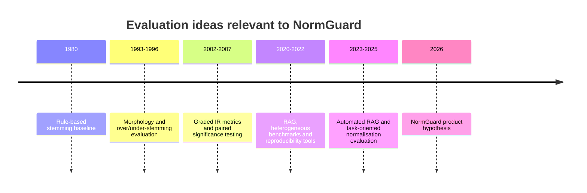

# Literature review and novelty assessment

> **Review date:** 18 September 2026  
> **Status:** Phase 1 evidence review; not a systematic review or patent-clearance opinion

## Executive conclusion

The broad NormGuard idea is **not novel**. Stemming and lemmatisation, over/under-stemming analysis, downstream task evaluation, ranked-retrieval benchmarks, RAG evaluation, reproducibility measures, protected terms, and relevance regression tooling all have substantial prior work.

The narrower opportunity is an engineering contribution:

> a local-first, engine-neutral normalisation assurance workflow that joins retrieval evidence, terminology/identifier damage, operational cost, uncertainty, and CI decisions in one reproducible evidence bundle.

No reviewed source establishes that this exact combination is first or unique. The correct Phase 1 conclusion is **proceed as a falsifiable product hypothesis**, not “novel invention confirmed.”

## Review questions

1. How has stemming quality traditionally been evaluated?
2. What evidence shows that preprocessing effects depend on language, collection, query, and retrieval model?
3. Which work already combines intrinsic transformation quality with downstream performance?
4. What do modern IR and RAG evaluation frameworks already provide?
5. Which remaining combination could be useful to developers?

## Search strategy

### Sources searched

- arXiv and publisher/venue pages for primary papers;
- ACM/SIGIR and journal records for classical stemming and IR evaluation;
- official project repositories or documentation when a paper introduced an evaluation tool;
- backward references from the closest task-oriented paper;
- terms and sources already identified in the NormGuard platform landscape.

### Search concepts

Searches combined variants of:

- `stemming evaluation`, `over-stemming`, `under-stemming`, `stemming information retrieval`;
- `lemmatization downstream evaluation`, `text normalization task oriented evaluation`;
- `retrieval preprocessing BM25 dense retrieval`;
- `information retrieval benchmark reproducibility statistical significance`;
- `RAG retrieval evaluation context relevance`;
- `protected terminology normalization safety`.

### Date coverage

Classical morphology/IR work from 1980 onward and modern retrieval/RAG work available by 18 September 2026 were eligible.

## Inclusion and exclusion

### Included

- primary research with a clear method or evaluation result relevant to morphology, retrieval, RAG evaluation, or reproducibility;
- established benchmark/tool papers that define evaluation infrastructure;
- work that reports negative, conditional, or trade-off findings;
- English and multilingual studies when their conclusion affects the generality of NormGuard claims.

### Excluded

- tutorials or marketing pages used as substitutes for a paper;
- papers about normalising social-media spelling, speech, or historical text when they do not inform retrieval/morphology decisions;
- studies without enough method detail to identify the comparison;
- unsupported “best stemmer” lists;
- patents: this review is not a freedom-to-operate search.

## Evidence map

| Work | Contribution | Important finding for NormGuard | What it does not establish |
|---|---|---|---|
| [Porter, 1980 — An algorithm for suffix stripping](https://tartarus.org/martin/PorterStemmer/def.txt) | Compact rule-based English suffix stripping | Algorithmic stemming is mature baseline technology | Task-specific safety or pipeline recommendation |
| [Krovetz, 1993 — Viewing Morphology as an Inference Process](https://dl.acm.org/doi/10.1145/160688.160718) | Dictionary/morphology-driven processing for IR | Conservative, linguistically informed processing predates modern lemmatisers | Cross-engine CI assurance |
| [Paice, 1994 — An Evaluation Method for Stemming Algorithms](https://doi.org/10.1145/181347.181389) | Quantifies over-stemming and under-stemming | Transformation errors require separate diagnosis, not one reduction score | Downstream retrieval alone is sufficient |
| [Hull, 1996 — Stemming Algorithms: A Case Study for Detailed Evaluation](https://doi.org/10.1145/243199.243204) | Detailed retrieval comparison of stemming approaches | Effectiveness varies; stemmer evaluation must examine queries and failure cases | One universally best method |
| [Järvelin & Kekäläinen, 2002 — Cumulated gain-based evaluation](https://doi.org/10.1145/582415.582418) | DCG/nDCG for graded relevance | Graded ranking quality is established and appropriate for ESCI labels | Terminology safety |
| [Smucker, Allan & Carterette, 2007 — Comparison of Statistical Significance Tests for IR Evaluation](https://doi.org/10.1145/1277741.1277756) | Compares significance procedures for paired IR experiments | Query-level uncertainty and paired testing matter | Statistical significance equals practical value |
| [BEIR, 2021](https://arxiv.org/abs/2104.08663) | Heterogeneous benchmark across 18 retrieval datasets and multiple architectures | BM25 remains a robust baseline; model performance varies across domains and compute costs | A normalisation-specific safety policy |
| [ir-measures, 2021](https://arxiv.org/abs/2111.13466) | Common interface over multiple IR evaluation tools | Metric calculation and interoperability already have reusable tooling | Failure diagnosis for transformed terminology |
| [repro_eval, 2022](https://arxiv.org/abs/2201.07599) | Reproducibility measures for system-oriented IR experiments | Reproduction and result comparison are established research goals | A production CI contract for text normalisation |
| [Lewis et al., 2020 — Retrieval-Augmented Generation](https://arxiv.org/abs/2005.11401) | Combines neural retrieval with generation | Retrieval is an explicit component whose quality affects downstream generation | Preprocessing safety evaluation |
| [Ragas, 2023/2025](https://arxiv.org/abs/2309.15217) | Reference-free metrics for retrieval and generation dimensions | RAG pipelines can be evaluated by separated component dimensions | Ground-truth retrieval evaluation or protected-term guarantees |
| [ARES, 2023/2024](https://arxiv.org/abs/2311.09476) | LM judges plus prediction-powered inference for RAG evaluation | Automated evaluation can use synthetic data with a smaller human-labelled set | Deterministic terminology safety or zero-corruption evidence |
| [Task-Oriented Evaluation Framework for Text Normalization, 2025](https://arxiv.org/abs/2511.20409) | SES, downstream model-performance delta, and semantic-distance measure | Closest conceptual overlap: reduction utility can hide harmful over-stemming, so downstream and damage evidence must be combined | Engine-neutral retrieval adapters, identifier policies, CI decisions, or production workflow |

## Historical progression

## Closest prior work

### 1. Task-oriented text-normalisation evaluation

The 2025 task-oriented framework is the closest conceptual paper. It explicitly argues that a word-reduction score is insufficient, combines reduction utility with downstream model-performance change, and uses edit-distance-based evidence to expose harmful over-stemming.

NormGuard must therefore not claim that it first:

- evaluates normalisation through downstream tasks;
- balances reduction against meaning damage;
- identifies that aggressive stemming can reduce downstream performance;
- compares multiple normalisation techniques with more than one metric.

Its possible extension is to translate this research idea into a developer-facing retrieval protocol with protected identifiers, engine adapters, versioned policies, statistical uncertainty, latency evidence, and CI outcomes.

### 2. Classical stemming evaluation

Paice and Hull already establish that stemmers create different kinds of error and that aggregate effectiveness can conceal query-level behaviour. NormGuard's F01 over-normalisation and F02 under-normalisation categories are modern engineering labels for established concerns, not new discoveries.

### 3. Search and IR evaluation infrastructure

BEIR, ir-measures, repro_eval, Elasticsearch rank evaluation, and OpenSearch Search Relevance Workbench demonstrate that benchmark datasets, standard metrics, common interfaces, reproducibility analysis, regression workflows, and experiment dashboards are established.

NormGuard can reuse them. Rebuilding a general relevance toolkit would add little.

### 4. RAG evaluation

Ragas and ARES separate retrieval/context quality from generated-answer quality and automate parts of evaluation. This means “RAG evaluation” is far too broad to be a differentiator.

NormGuard's RAG contribution, if retained, should be limited to tracing how a specific normalisation policy changes retrieved evidence and downstream results. RAG should remain exploratory until lexical retrieval evidence is credible.

## Contradictions and negative findings

| Tension | Evidence-based interpretation | Design consequence |
|---|---|---|
| Stemming can improve matching but can also conflate meanings | Classical over/under-stemming work and task-oriented evaluation both show the trade-off | Report utility and damage separately |
| A smaller vocabulary is operationally attractive but not proof of better retrieval | Reduction metrics can reward aggressive processing | Vocabulary reduction remains secondary |
| BM25 is old but remains a strong baseline | BEIR reports robust average performance | Start with lexical retrieval; do not treat dense retrieval as automatically superior |
| Dense/RAG systems reduce exact lexical dependence but do not remove preprocessing risk | Modern frameworks still evaluate retrieval/context separately | Test dense/hybrid later; do not assume morphology is irrelevant |
| Reference-free or LM-judged metrics scale evaluation but introduce judge/model dependence | Ragas and ARES trade manual labels for automated estimation | Keep human-reviewed protected-term gates deterministic |
| Statistical significance can coexist with a trivial effect | IR significance literature separates evidence from practical importance | Require both confidence and minimum effect H2 |
| One configuration may not dominate quality, safety, and latency | Heterogeneous benchmarks expose domain/model variation | Permit a Pareto set or inconclusive result |

## Novelty matrix

| Proposed element | Prior art strength | NormGuard position |
|---|---:|---|
| Stemming/lemmatisation algorithms | Very strong | Reuse |
| Protected words and analyzer exceptions | Very strong | Reuse and verify |
| Over/under-stemming diagnosis | Strong | Extend into operational taxonomy |
| Downstream task-oriented evaluation | Strong | Apply to retrieval protocol |
| Standard IR metrics and confidence tests | Very strong | Reuse correctly |
| RAG component evaluation | Strong | Optional integration |
| Cross-engine normalisation adapters | Partial/fragmented in reviewed work | Candidate contribution |
| Identifier-specific zero-corruption gate | Limited direct coverage found | Candidate contribution |
| Joint safety–utility–latency decision | Partial ingredients exist | Candidate integration |
| Versioned CI evidence bundle with abstention/inconclusive outcome | Partial ingredients exist | Candidate product contribution |

## Dated novelty assessment

### Safe statement

As of 18 September 2026, reviewed research and first-party product documentation show extensive prior work for every major component of NormGuard. This review did not identify one source that packages cross-engine normalisation experiments, protected identifier/terminology policies, transformation failure codes, retrieval and operational metrics, and uncertainty-aware CI decisions into the exact proposed workflow.

### Unsafe statements

Do not state that NormGuard is:

- the first text-normalisation evaluator;
- the first task-aware stemming framework;
- the first safe lemmatisation system;
- the first search relevance regression tool;
- the first RAG evaluation framework;
- proven unique, patentable, or free to operate.

Absence from this bounded review is not evidence of absence.

## Research-to-product boundary

NormGuard should contribute integration, reproducibility, diagnosis, and developer usability. It should not present established algorithms or metrics as inventions.

## Phase 2 implications

1. Implement the smallest experiment that can falsify the value proposition: C0 versus C4 on the frozen ESCI protocol.
2. Use existing metric implementations rather than writing new nDCG/MRR code without need.
3. Make the terminology fixture and evidence schema the centre of the POC.
4. Keep RAG, dense retrieval, automatic recommendations, and broad dashboards out of the first build.
5. Interview developers specifically about configuration drift, protected identifiers, and difficulty reproducing analyzer changes.
6. Stop the platform direction if engine-native tooling plus a simple test script meets the need.

## Review limitations

- This is a bounded narrative review, not PRISMA-compliant systematic research.
- Publisher indexing and terminology vary, so close work may have been missed.
- Recent preprints may change after peer review.
- The task-oriented 2025 work is a preprint and should be interpreted accordingly.
- Product capabilities change; the separate platform review must be rechecked before release.
- No patent databases, legal claims, or proprietary products were exhaustively searched.

## Phase 1 verdict

**Proceed conditionally.** The research supports building a narrow proof of concept to test developer value, but it does not support a broad novelty claim. The strongest POC is an assurance layer, not a new lemmatiser and not another general relevance dashboard.
