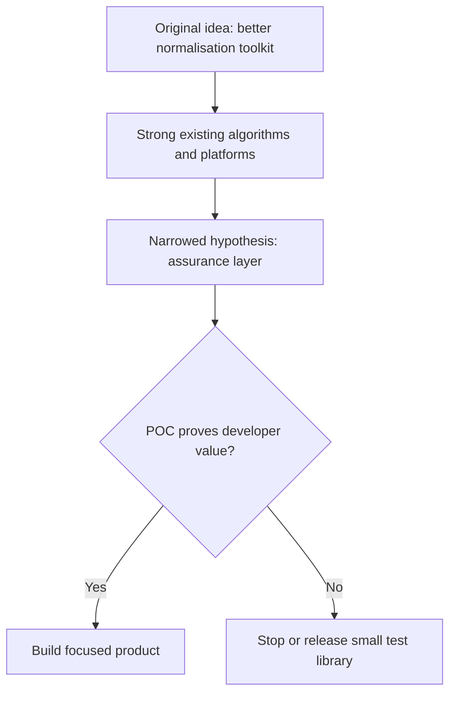
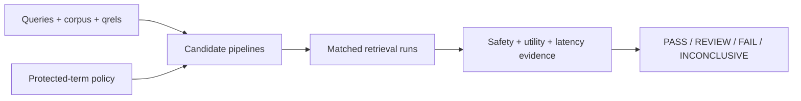
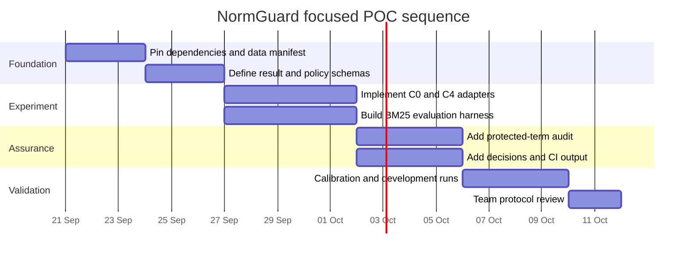

# Phase 1 research decision

> **Decision:** Proceed conditionally to a narrow proof of concept  
> **Evidence cut-off:** 18 September 2026  
> **Project stage:** Research complete; implementation not yet validated

## Executive verdict

NormGuard should continue, but its original broad position must change.

**Do not build:** another lemmatiser, analyzer builder, generic relevance dashboard, or broad RAG evaluation platform.

**Test instead:** a local-first, engine-neutral assurance layer that determines whether a normalisation change improves retrieval **without damaging protected terminology or identifiers**, and packages the evidence for review and CI.

## Phase 1 scorecard

| Research question | Evidence | Decision | Confidence |
|---|---|---|---:|
| Do stemming and lemmatisation tools already exist? | NLTK, spaCy, Stanza, Snowball and others are mature | Reuse them | High |
| Can engines already protect terms? | Elasticsearch and Solr document exclusions/protected filters | Protection alone is not differentiation | High |
| Does relevance testing already exist? | Elasticsearch rank evaluation and OpenSearch Workbench provide substantial support | Do not build a generic workbench | High |
| Is task-oriented normalisation evaluation new? | Classical and 2025 research already evaluates errors and downstream effects | Do not claim novelty | High |
| Is there one universally best pipeline? | Literature and heterogeneous benchmarks show context-dependent results | Permit Pareto/inconclusive outcomes | High |
| Is a cross-engine safety evidence contract useful? | No complete match found in this bounded review | Test with developers and a POC | Medium |
| Are three domains ready for equal benchmarking? | Retail has the strongest judged dataset; medical is restricted; cyber lacks qrels | Start with retail only | High |

## What NormGuard now means

> **NormGuard is a developer assurance layer for text-normalisation changes in retrieval systems. It compares candidate pipelines, protects domain-critical terms, measures quality and operational trade-offs, and produces reproducible evidence for human review and CI.**

### Evidence flow

## Differentiation after research

| Established capability | NormGuard must reuse | Candidate added value |
|---|---|---|
| Stemming and lemmatisation | Library/model adapters | Comparable traces and evidence |
| Engine analyzer configuration | Elasticsearch/OpenSearch/Solr APIs | Engine-neutral protocol |
| Protected-word lists | Native engine controls | Versioned P0–P3 policy and verification |
| IR measures | Existing tested metric libraries | Joint safety–utility–latency decision |
| Relevance experiments | Engine-native evaluation where useful | Cross-engine reproducibility manifest |
| Dashboards | Existing visual/relevance tools | Focused failure evidence, not dashboard duplication |
| RAG evaluation | Ragas/ARES-style tools later | Trace preprocessing impact only |

## Non-negotiable product boundaries

NormGuard will not claim:

- to invent stemming, lemmatisation, protected terms, IR metrics, or RAG evaluation;
- to select a universally best analyzer;
- that vocabulary reduction automatically saves meaningful LLM cost;
- clinical, legal, or cybersecurity safety certification;
- uniqueness, patentability, or freedom to operate;
- success when evidence is incomplete.

NormGuard must be able to return **INCONCLUSIVE**.

## Approved proof-of-concept

### Scope

| Item | Phase 2 choice |
|---|---|
| Domain | English retail product search |
| Dataset | Amazon Shopping Queries ESCI reduced ranking data |
| Retrieval | Lexical BM25 confirmatory experiment |
| Primary comparison | C0 minimal baseline versus C4 protected POS-aware lemmatisation |
| Primary metric | Query-level nDCG@10 |
| Safety gates | Zero unauthorised P0 changes; 100% identifier retention; zero S0 events |
| Operational gate | p95 no more than 2× baseline and no more than 10 ms added per query |
| Outcome | PASS, REVIEW, FAIL, or INCONCLUSIVE |

### Explicit exclusions

- no production web dashboard;
- no dense/hybrid/RAG claim in the confirmatory POC;
- no medical or cybersecurity retrieval-quality claim;
- no automatic LLM-generated safety labels;
- no large plugin ecosystem;
- no final-test tuning;
- no “AI recommends the best pipeline” marketing.

## Risk register

| Risk | Likelihood | Impact | Phase 2 control | Stop signal |
|---|---:|---:|---|---|
| Existing tools already solve the workflow adequately | Medium | High | Developer interviews and thin adapter POC | Teams prefer simple engine scripts |
| Normalisation yields no useful retrieval improvement | Medium | High | Frozen C0/C4 test | H1/H2 fail without compensating value |
| Safety rules require excessive manual upkeep | Medium | High | Measure review and abstention rate | Maintenance cost exceeds demonstrated value |
| Dataset artefact/use terms block reproducibility | Low–Medium | High | Recheck exact artefact and avoid redistribution | Permission remains unclear |
| Cross-engine abstraction hides important differences | Medium | Medium | Preserve engine-native traces | Common schema loses causal evidence |
| Identifier extraction is too brittle | Medium | High | Calibration-only rule design and manual audit | P0 coverage cannot be trusted |
| Scope grows into generic relevance/RAG tooling | High | Medium | Enforce exclusions and protocol | Phase 2 work bypasses core hypothesis |
| Results are statistically detectable but trivial | Medium | Medium | H2 minimum effect | Improvement below 0.005 absolute nDCG@10 |

## Phase 2 entry gates

Implementation can begin only after these are resolved:

- [ ] exact ESCI artefact, version, terms, and checksums are pinned;
- [ ] C0 and C4 libraries/models are selected and versioned;
- [ ] BM25 implementation and indexed fields are declared;
- [ ] protected-term extraction rules are reviewed;
- [ ] fixed experiment seed and environment are recorded;
- [ ] no final-test result has been inspected;
- [ ] at least two team members approve protocol NG-POC-001;
- [ ] collaborators have accepted repository invitations.

## Phase 2 build sequence

Dates are planning placeholders, not commitments. Final-test execution is deliberately excluded until the approval checklist is complete.

## Success and stop decisions

| Result | Action |
|---|---|
| C4 improves nDCG@10, passes practical effect, safety and latency gates | Continue to a second adapter and developer pilot |
| Safety passes but retrieval evidence is mixed | Publish REVIEW/Pareto evidence; investigate developer value before expansion |
| Retrieval improves but any safety hard gate fails | FAIL; do not recommend C4 |
| Evidence is incomplete, underpowered, or non-reproducible | INCONCLUSIVE; fix evidence, do not market a win |
| Engine-native scripts provide equivalent value with much less complexity | Stop platform work; release minimal fixtures/library if useful |

## Supporting evidence

- [Research charter](charter.md)
- [Landscape and search-platform review](landscape.md)
- [Developer workflows and interview guide](use-cases.md)
- [Dataset and licensing assessment](dataset-assessment.md)
- [Terminology-safety taxonomy](terminology-safety.md)
- [Literature and novelty assessment](literature-review.md)
- [Frozen proposed evaluation protocol](evaluation-plan.md)
- [Architecture](../docs/architecture.md)
- [Visual system](../docs/visual-system.md)

## Phase 1 completion statement

Phase 1 achieved its purpose: it prevented NormGuard from becoming a duplicate of existing NLP and search tooling, narrowed the product to a testable developer problem, selected a credible first dataset, defined safety evidence, and froze a falsifiable evaluation protocol.

The research does **not** prove market demand or technical benefit. Phase 2 exists to test those two uncertainties with the smallest credible implementation.
