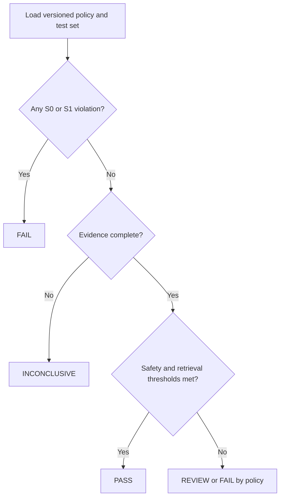

# Terminology-safety taxonomy

> **Phase 1 research artifact · Proposed taxonomy · 18 September 2026**

NormGuard should answer two different questions:

1. Did normalisation improve the retrieval task?
2. Did it preserve the terms that the domain cannot afford to corrupt?

A retrieval gain does not cancel a protected-term failure. This taxonomy therefore separates **utility evidence** from **terminology-safety evidence** and permits an inconclusive result.

## Scope and research status

This document defines candidate policies, failure classes, metrics, annotation fields, and CI decisions for the proof of concept. It does **not** establish that NormGuard is safe for production or regulated use. Thresholds must be validated with domain reviewers and representative datasets.

## Policy classes

Policies are explicit, versioned, and applied consistently to query and index text.

| Class | Name | Expected behaviour | Examples | Default test |
|---|---|---|---|---|
| **P0** | Exact preserve | Keep the original surface form and offsets unchanged | product identifiers, drug names, version strings, citations | byte/surface equality |
| **P1** | Approved alias | Map only through a reviewed, reversible alias table | approved brand alias, controlled singular/plural pair | allow-list membership |
| **P2** | Context normalisable | Normalise ordinary language using context such as part of speech and locale | vulnerabilities → vulnerability; diagnoses → diagnosis; shoes → shoe | expected lemma plus context |
| **P3** | Review or abstain | Preserve and flag when identity or meaning is uncertain | unseen entities, ambiguous abbreviations, mixed-language terms | unchanged plus review event |

P0 is the strongest constraint. P1 mappings must record their source and policy version. P2 is never permission to transform protected spans. P3 makes uncertainty visible instead of forcing a potentially harmful output.

## Cross-domain test cards

| Domain | Input | Expected policy | Acceptable result | Failure example |
|---|---|---:|---|---|
| Cybersecurity | `vulnerabilities` | P2 | `vulnerability` | unrelated or truncated stem |
| Medical | `diagnoses` | P2 | `diagnosis` | `diagnose` when the noun is required |
| Medical | registered drug name | P0/P3 | unchanged or flagged | altered name |
| Retail | `shoes` | P2 | `shoe` | missed equivalence |
| Retail | `SKU-AX2048` | P0 | unchanged | punctuation or suffix removed |
| Cross-domain | `organization` | P2 | policy-approved lemma or unchanged | `organ` |

These are test designs, not measured results.

## Failure taxonomy

| Code | Failure class | What went wrong | Typical impact |
|---|---|---|---|
| **F01** | Over-normalisation | Distinct meanings collapse to one form | false matches; precision loss |
| **F02** | Under-normalisation | Equivalent forms remain disconnected | missed matches; recall loss |
| **F03** | Incorrect lemma | Output is grammatical but wrong for the context | semantic drift |
| **F04** | Identifier corruption | A P0 identifier changes | traceability and lookup failure |
| **F05** | Named-entity corruption | A person, product, organisation, drug, or place changes incorrectly | entity confusion |
| **F06** | Negation or polarity damage | Meaning flips or loses a negation cue | dangerously inverted intent |
| **F07** | Boundary or offset corruption | Span boundaries no longer align with source text | broken highlighting or annotations |
| **F08** | Query/index asymmetry | The two sides use incompatible analysis policies | silent retrieval mismatch |
| **F09** | Language or locale mismatch | A policy is applied to an unsupported language or locale | invalid transformations |
| **F10** | Policy drift | Tool, model, dictionary, or rules change without an approved baseline | unreproducible behaviour |

A single case can carry multiple failure codes. For example, changing a retail SKU can be both F04 and F07.

## Severity model

| Severity | Definition | Default CI consequence |
|---|---|---|
| **S0 Blocker** | P0 corruption, polarity damage, or an untraceable policy change | Fail |
| **S1 Critical** | repeatable entity corruption or material semantic drift | Fail |
| **S2 Major** | retrieval regression or meaningful under/over-normalisation | Review or fail by threshold |
| **S3 Minor** | cosmetic or low-impact difference with preserved meaning | Report |

Severity is determined from the observed consequence, not only from the transformation type.

## Measurement model

Let:

- \(P\) be protected terms observed;
- \(P_c\) be protected terms changed without permission;
- \(T\) be reviewed transformations;
- \(T_h\) be transformations labelled harmful;
- \(I\) be identifiers observed;
- \(I_r\) be identifiers retained exactly;
- \(A\) be comparable query/index cases;
- \(A_m\) be asymmetric cases.

\[
\text{Protected-term violation rate} = \frac{P_c}{P}
\]

\[
\text{Harmful transformation rate} = \frac{T_h}{T}
\]

\[
\text{Exact identifier retention} = \frac{I_r}{I}
\]

\[
\text{Query/index asymmetry rate} = \frac{A_m}{A}
\]

Every experiment should also report the selected retrieval metrics—such as nDCG@10, MRR@10, Recall@k, or a domain-approved alternative—with confidence intervals or paired significance testing where the sample permits it. Report the abstention/review rate so safety is not achieved merely by declining every transformation.

No denominator should silently become zero. Emit **not applicable** and record the missing evidence.

## CI decision flow



| Outcome | Meaning | Required action |
|---|---|---|
| **PASS** | mandatory safety gates and declared retrieval thresholds are met | publish evidence bundle |
| **REVIEW** | no blocker exists, but a threshold or ambiguous case needs human judgment | assign domain review |
| **FAIL** | a mandatory gate failed | block release |
| **INCONCLUSIVE** | coverage, labels, or denominators are insufficient | collect evidence; do not claim improvement |

Recommended initial hard gates for the POC are **zero unauthorised P0 changes**, **100% exact identifier retention**, and **zero S0 events**. These are hypotheses to validate, not production guarantees.

## Annotation record

Each reviewed example should be reproducible without exposing sensitive source data.

```json
{
  "case_id": "retail-00042",
  "domain": "retail",
  "locale": "en-US",
  "input": "SKU-AX2048 shoes",
  "candidate_output": "SKU-AX2048 shoe",
  "spans": [
    {
      "text": "SKU-AX2048",
      "policy_class": "P0",
      "expected": "SKU-AX2048",
      "observed": "SKU-AX2048"
    },
    {
      "text": "shoes",
      "policy_class": "P2",
      "expected": "shoe",
      "observed": "shoe"
    }
  ],
  "failure_codes": [],
  "severity": null,
  "review_status": "accepted",
  "policy_version": "0.1.0",
  "engine_version": "candidate-build-id",
  "reviewer_role": "domain-reviewer"
}
```

Minimum provenance also includes dataset version, split, normaliser configuration, run timestamp, and a hash of the evaluation inputs. Sensitive records should use approved redaction or controlled storage rather than being committed to the repository.

## Annotation guidance

1. Mark protected spans before evaluating the candidate output.
2. Judge semantic correctness in the original sentence or query, not as an isolated token.
3. Assign the policy class before assigning a failure code.
4. Record every applicable failure code, then assign the highest resulting severity.
5. Use two reviewers for ambiguous or high-severity cases; preserve disagreement.
6. Keep an adjudication note and never rewrite the original annotation silently.
7. Sample unchanged outputs as well as changed outputs to detect under-normalisation.

## Evidence required for a claim

A NormGuard comparison should publish:

- baseline and candidate configurations;
- versioned policy and protected-term list;
- dataset, split, licence constraints, and sampling method;
- retrieval metrics with uncertainty;
- all terminology-safety metrics;
- failure counts by code, severity, domain, and policy class;
- abstention and human-review rates;
- unresolved disagreements and limitations;
- a machine-readable result with a PASS, REVIEW, FAIL, or INCONCLUSIVE outcome.

## Phase 1 validation questions

- Can independent reviewers assign the same policy class and failure code?
- Do P0/P1 rules cover real protected terms without excessive manual maintenance?
- Does POS- and locale-aware P2 processing reduce F01–F03 errors?
- Can query/index asymmetry be detected from configuration and behavioural tests?
- Which thresholds are credible for retail, medical, and cybersecurity contexts?
- Does the four-outcome CI model prevent unsupported “winner” claims?

The taxonomy should be revised after the first annotation pilot and developer interviews. A useful outcome of Phase 1 may be narrowing or rejecting parts of this design.
