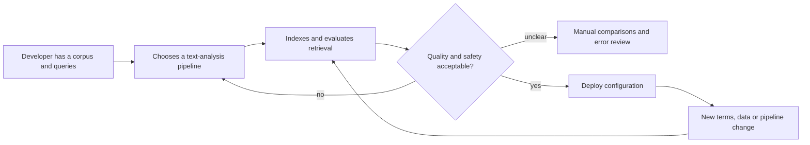

# Developer Workflows and Discovery Guide

Status: **Phase 1 research draft — no product validation claimed**

## Purpose

NormGuard should be evaluated against decisions developers already make. These workflows define the inputs, risks, expected evidence and falsification conditions for three domains. They are research instruments, not feature promises.

## Shared decision journey

The proposed opportunity sits between pipeline choice and deployment: make comparisons reproducible, expose terminology damage and preserve an approved baseline.

---

## Workflow 1 — Cybersecurity retrieval and reporting

### Actor

A search, security or AI engineer maintaining retrieval over scanner findings, vulnerability evidence, remediation guidance and product documentation.

### Example corpus

- vulnerability findings and scanner output;
- CVE/CWE/OWASP references;
- product and package names;
- commands, file paths, hostnames and ports;
- remediation and evidence text.

### Current decision

The engineer decides whether stemming or lemmatisation will improve searches such as:

- “vulnerable services exposed on port 443”;
- “authentication bypass vulnerabilities”;
- “packages affected by CVE-2026-1234”.

### Risk

Aggressive processing can corrupt or conflate identifiers and technical terms. A pipeline can also improve general-language matching while making exact evidence harder to retrieve.

| Term class | Example | Required behaviour |
|---|---|---|
| Vulnerability identifier | `CVE-2026-1234` | preserve exactly |
| Weakness identifier | `CWE-79` | preserve exactly |
| Product/library | `OpenSSL`, `FastAPI` | protect case or canonical alias |
| Command/path | `/etc/passwd`, `kubectl` | preserve or apply explicit policy |
| Natural-language variant | vulnerabilities / vulnerability | candidate for normalisation |

### Evidence required

- Recall@k and nDCG@k for judged security queries;
- exact-identifier retrieval success;
- protected-term violation rate;
- examples of harmful conflation;
- latency and index-size change.

### Disproof condition

The use case does not justify NormGuard if existing analyzer tests and a small protected-word list solve the workflow with no meaningful comparison or regression burden.

---

## Workflow 2 — E-commerce catalogue search

### Actor

A search or platform engineer maintaining retrieval over product titles, descriptions, attributes, brands, SKUs and customer queries.

### Example corpus

- catalogue titles and descriptions;
- brands and model numbers;
- category and attribute values;
- spelling, plural and inflection variants;
- short customer queries.

### Current decision

The engineer decides how to match queries such as:

- “running shoes for women”;
- “wireless mouse” versus “wireless mice”;
- “Samsung S26 cases”;
- exact SKU or model searches.

### Risk

Under-normalisation may miss useful variants. Over-normalisation may merge distinct brands or product concepts, reducing precision and commercial relevance.

| Term class | Example | Required behaviour |
|---|---|---|
| Brand | `New Balance` | protect as a named entity |
| SKU | `NB-W1080-V15` | preserve exactly |
| Model | `Galaxy S26` | preserve model semantics |
| Inflection | shoe / shoes | evaluate candidate normalisation |
| Potential conflation | organ / organisation | detect unrelated merges |

### Evidence required

- product relevance at top-k;
- zero-result and reformulation rate on a fixed query set;
- brand/SKU corruption rate;
- head-query and long-tail results separately;
- p50/p95 analysis latency.

### Disproof condition

The use case does not justify NormGuard if the catalogue platform’s existing synonyms, analyzers and relevance-testing workflow already provides equivalent evidence with low maintenance cost.

---

## Workflow 3 — Precision-sensitive professional retrieval

Healthcare and legal data should not be mixed into one benchmark. Phase 1 may select one domain after dataset and licensing review.

### Actor

An engineer supporting controlled retrieval over medical guidance or legal documents, with domain experts responsible for relevance and safety judgements.

### Example corpus

Healthcare candidates:

- clinical guidance and approved terminology;
- medicine names, conditions and procedures;
- patient-facing information.

Legal candidates:

- statutes, clauses, judgments and policies;
- citations, defined terms and jurisdictional language;
- contract templates and amendments.

### Current decision

The engineer decides whether linguistic normalisation improves natural-language discovery without changing critical professional terminology.

### Risk

A superficially reasonable transformation may alter legal or clinical meaning. Domain expert judgement is necessary; automatic semantic similarity is not enough.

| Term class | Example | Required behaviour |
|---|---|---|
| Medicine or defined term | domain-approved vocabulary | preserve canonical form |
| Citation | statute/case reference | preserve exactly |
| General inflection | treatments / treatment | evaluate |
| Ambiguous word | context-dependent | flag for expert review |

### Evidence required

- expert-judged Recall@k and nDCG@k;
- critical-term violation rate;
- false-positive retrieval analysis;
- explicit abstention or inconclusive rate;
- traceable transformation explanations.

### Disproof condition

The use case should be removed if suitable licensed data and expert relevance judgements cannot be obtained. Synthetic examples alone are insufficient for safety claims.

---

## Cross-domain comparison

| Requirement | Cybersecurity | E-commerce | Healthcare/legal |
|---|---:|---:|---:|
| Exact identifiers | Critical | Critical | Critical |
| Inflection matching | Useful | High value | Useful |
| Named-term protection | High | High | Critical |
| Domain expert review | Security reviewer | Search/relevance owner | Mandatory specialist |
| Commercial sensitivity | Moderate | High | Variable |
| Safety consequence | Evidence corruption | Poor ranking/conversion | Potential professional harm |

## Neutral developer interview guide

The interviewer should not introduce NormGuard until the current workflow is understood.

### Current workflow

1. Tell us about the last time you changed a tokenizer, analyzer, stemmer or lemmatiser.
2. What problem were you trying to solve?
3. How did you decide which configuration to try?
4. What evidence was required before deployment?
5. Which tools and reports did you use?
6. How long did the comparison and review take?

### Failure and risk

7. Have text-processing changes ever reduced relevance or damaged important terminology?
8. How was the problem discovered?
9. Which terms or patterns must remain unchanged?
10. What regression checks exist today?
11. Which failure would prevent deployment?

### Value and adoption

12. Which part of this workflow is most manual or uncertain?
13. Would a recommendation be useful, or do you need only comparable evidence?
14. What would make you distrust an automatic recommendation?
15. Where should a quality check run: locally, in CI, during indexing or in monitoring?
16. What integration effort would be unacceptable?

### Closing

17. What existing product already solves most of this problem for you?
18. Who else owns or reviews this decision?
19. May we use an anonymised version of this workflow to refine the research?
20. What important question did we fail to ask?

## Interview evidence template

| Field | Record |
|---|---|
| Participant role | No unnecessary personal data |
| Domain and system type | Lexical, dense, hybrid or RAG |
| Current tools | Named tools and versions where relevant |
| Triggering decision | What changed and why |
| Evaluation method | Dataset, metrics and reviewers |
| Failure example | Anonymised concrete incident |
| Protected terminology | Categories, not sensitive values |
| Time/effort | Approximate |
| Existing solution | What already works |
| Unmet need | Participant’s words, minimally paraphrased |
| Adoption blocker | Integration, trust, cost or governance |

## Validation threshold

Before the proof of concept, the team should obtain at least:

- two relevant interviews or documented workflows per selected domain;
- one concrete recent pipeline decision per domain;
- one measurable failure mode per domain;
- evidence that the comparison or regression task is not already adequately solved.

If those conditions are not met, narrow the project to the strongest validated domain instead of maintaining artificial cross-industry scope.
